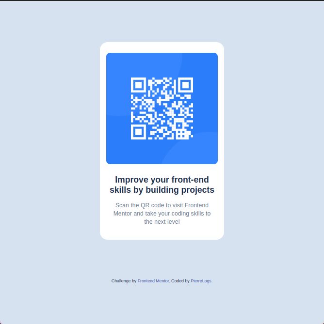

# Frontend Mentor - QR code component solution

This is a solution to the [QR code component challenge on Frontend Mentor](https://www.frontendmentor.io/challenges/qr-code-component-iux_sIO_H). Frontend Mentor challenges help you improve your coding skills by building realistic projects.

## Table of contents

- [Overview](#overview)
  - [Screenshot](#screenshot)
  - [Links](#links)
- [My process](#my-process)
  - [Built with](#built-with)
  - [What I learned](#what-i-learned)
  - [Continued development](#continued-development)
  - [Useful resources](#useful-resources)
- [Author](#author)

## Overview

### Screenshot



### Links

- Solution URL: [QR Code component solution repo](https://github.com/PierreLogs/QR-Code-property)
- Live Site URL: [QR Code component solution page](https://pierrelogs.github.io/QR-Code-property/)

## My process

### Built with

- Semantic HTML5 markup
- CSS custom properties
- Flexbox
- Mobile-first workflow

### What I learned

I learned a how to create a QR code component. usign the HTML semantics, BEM method and CSS custom property.

```html
<!--QR container>-->
<main class="content">
  <!--QR code-->
  <figure class="content__image">
    
  </figure>

  <!--Text-->
  <section class="content__text">
    <h1>Improve your front-end skills by building projects</h1>
    <p>
      Scan the QR code to visit Frontend Mentor and take your coding skills to
      the next level
    </p>
  </section>
</main>
```

```css
/*QR Code container*/
.content {
  background-color: var(--white-background);
  height: 510px;
  width: 320px;
  display: flex;
  justify-content: center;
  align-items: center;
  flex-direction: column;
  border-radius: 20px;
  gap: var(--space-300);
}

/*QR Code*/
.content > .content__image > img {
  width: 288px;
  height: 288px;
  border-radius: 10px;
}

/*Text*/
.content > .content__text {
  width: 288px;
  height: 140px;
  text-align: center;
  padding: 0 6px;
  display: flex;
  flex-direction: column;
  gap: var(--space-200);
}
```

### Continued development

I want to continue working on this project, and learn more about responsive design, card design, flexbox and grid css.

### Useful resources

- [CSS MDN](https://developer.mozilla.org/es/docs/Learn/CSS) - This helped me for understand CSS.

- [CSS Tricks](https://css-tricks.com/) - This is a great resource for learning CSS.

- [¿Qué es BEM CSS?](https://animaticss.com/articulo/que-es-bem-css/) - This is an amazing article which helped me finally understand BEM method. I'd recommend it to anyone still learning this concept.

## Author

- Github - [@PierreLogs](https://github.com/PierreLogs)
- Frontend Mentor - [@PierreLogs](https://www.frontendmentor.io/profile/PierreLogs)
- Twitter - [@lepierre19](https://x.com/lepierre19)
